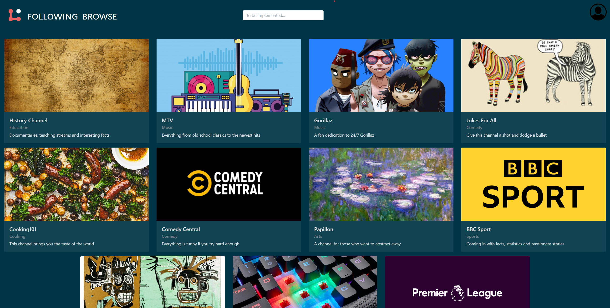
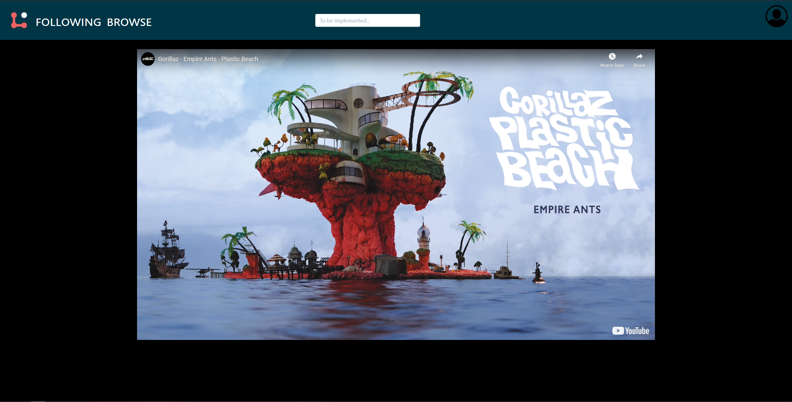
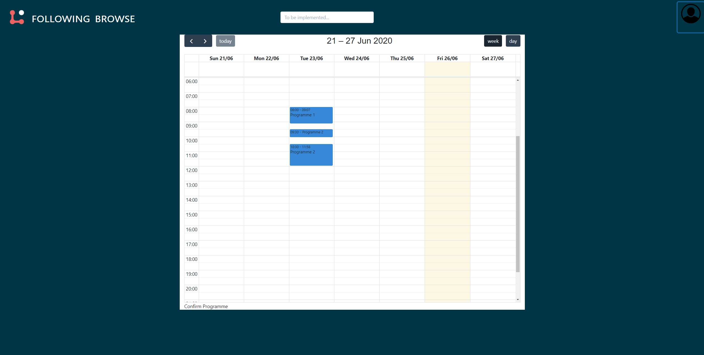

## Babite - An online serverless streaming platform

Babite is a video streaming platform that utilizes the Youtube API for create television programmes with Youtube videos.
The goal is to allow users to switch on any channel and watch content without the need for them to make decisions or spend time searching for content.

The home screen, where users both registered and unregistered users can watch content

----------------------------
An example of a channel, where the current video within a programme is played

----------------------------
The programme creator, where users can create scheduled programmes for the upcoming week, month, or year.

----------------------------
